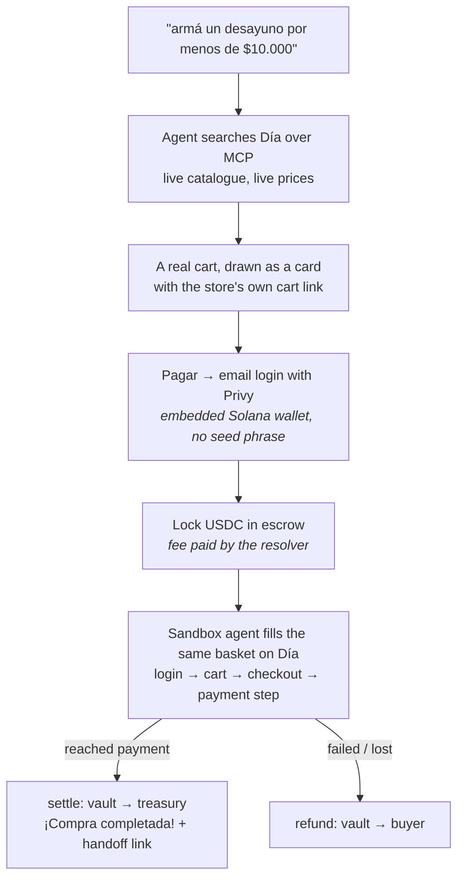
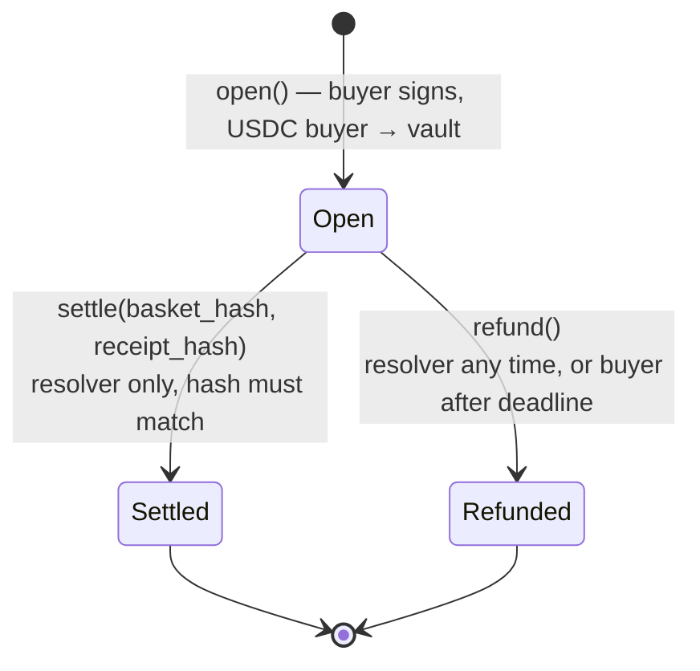
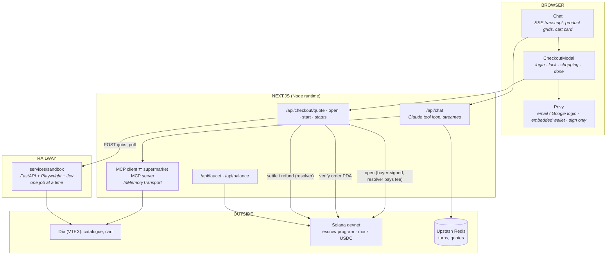

# changuito

**An AI agent that does your Argentine supermarket shop, paid in USDC on Solana,
with the money held in an on-chain escrow until the agent proves it could buy
the basket.**

You ask for a basket in plain Spanish. The agent searches a real store's live
catalogue, compares real prices and builds a real cart. You pay in USDC from an
email login, without a seed phrase or gas. The USDC is locked in an escrow
program on Solana. A sandboxed browser agent then walks the store's own checkout
with that basket. If it reaches the payment step, the escrow settles. If it
fails, the escrow refunds you, and nobody has to approve that by hand.

*changuito* is what an Argentine calls a shopping trolley.

| | |
|---|---|
| **Hackathon** | Crypto World's Fair (Solana Foundation × Colosseum) — branch `feat/solana-devnet` |
| **Network** | **Solana devnet only**: our own mock USDC mint, faucet in the app |
| **Reviewing this?** | **[docs/judges.md](docs/judges.md)**: a 15-minute path through the repo, with claims mapped to evidence |
| **Videos** | Pitch: _link pending_ · Demo: _link pending_ (sources in [`creatives/`](creatives/)) |
| **License** | MIT |

---

## Who this is for

**The first customer is someone who holds dollars, and has a family in Argentina
that needs groceries.** The emigrant in Madrid, the freelancer paid in USDC, the
expat whose parents live in Rosario. Today they send money and then make a phone
call about what to buy. With changuito they say *"armá la compra de la semana
para mi vieja, sin TACC, hasta $80.000"* and pay. The agent does the shop at the
supermarket nearest the delivery address.

That person has three things in common:

1. They hold **USDC, not pesos**, and want to keep it that way until the moment
   of purchase.
2. They **cannot use an Argentine crypto card**. Lemon, Belo and the other local
   cards are issued to Argentine residents with local KYC, and they solve paying,
   not shopping.
3. They are **paying for something they will not see arrive**, which is why the
   money sits in escrow rather than being handed to us.

The second customer, later, is an Argentine already paid in stablecoins who wants
the week's shop done without opening four supermarket apps. The first customer is
narrower and needs the product more, so it is the one we build for now.

### "Why not just use a crypto card?"

Because the card was never the product. A crypto card lets you **pay** a
supermarket. It does not **build the basket**, compare four chains' prices, notice
that the 1.5 L costs less than two 750 ml bottles, or handle a substitution when
something is out of stock. Choosing what to buy takes 40 minutes; paying takes
about 40 seconds. changuito does the 40 minutes.

The card also gives the payer nothing to hold onto. Once you have paid, a
failed delivery means you dispute it with the issuer. With changuito the funds
are in a program account that can only go to one of two places: the treasury,
once the basket is proven at checkout, or back to the buyer. That rule is
enforced by the program, not by us (see [On chain](#what-is-on-chain-and-why)).

And for the first customer above, a local card is not available at all.

---

## What the shopper does





The buyer never depends on the operator to get their money back. If our server
disappears, `refund()` opens to the buyer themselves once the deadline passes.

---

## What is on chain, and why

Full detail in **[docs/solana.md](docs/solana.md)**.

| | Address (Solscan, devnet) |
|---|---|
| **Escrow program** `changuito_escrow` (Anchor 0.32) | [`9A2PXJaf…B2wC9`](https://solscan.io/account/9A2PXJafYxym4i8ah1QFQZngqz2j7rQh8xQX2eXB2wC9?cluster=devnet) |
| **Config PDA** `["config"]`: resolver, treasury, mint. Set once; the program has no setter | [`BfMWiygm…yTQ`](https://solscan.io/account/BfMWiygm3XRab8xbJC355rxRZ4DFYqR2vyi1gjSjWyTQ?cluster=devnet) |
| **Mock USDC** (6 decimals, minted by the in-app faucet) | [`9rYNCiaa…tdMM`](https://solscan.io/account/9rYNCiaaKQ5rT1QR8Ar6FJVUr7gnwZy3RYAT6MtAtdMM?cluster=devnet) |
| **Resolver**: settles, refunds, mints faucet USDC | [`AgTnHC9d…qQ5`](https://solscan.io/account/AgTnHC9dmyuzjwp3oCRzaYrZbgeXD4tC2uSXmKhiyqQ5?cluster=devnet) |
| **Treasury**: receives settled baskets | [`EV5c3mjE…ZPS`](https://solscan.io/account/EV5c3mjEHBtTU6JmX31eLsfKX5zPgMVDEiKDhqjApZPS?cluster=devnet) |

**What each piece does:**

- **Escrow program** ([`anchor/programs/changuito_escrow`](anchor/programs/changuito_escrow/src/lib.rs)).
  - **`open`**: the buyer signs. It creates an order PDA `["order", id]` and a vault token account `["vault", id]`, stores the basket's SHA-256 and a deadline, and moves the USDC in. It rejects a zero amount, a timeout outside the 5-minute to 30-day range, and a reused order id.
  - **`settle`**: callable by the resolver only. The order must be open and the basket hash must match. It pays the treasury, records a receipt hash, and closes the vault (the rent goes back to the buyer).
  - **`refund`**: the resolver can call it at any time; the buyer can call it after the deadline.
- **The basket hash is what makes the escrow mean something.** The program will not settle unless the resolver presents the same canonical basket the buyer locked funds against. A server that wanted to charge for a different basket would need a different hash, and the program rejects that.
- **The chain is the order book.** "Mis compras" is a `getProgramAccounts` query filtered by buyer. There is no orders table to drift from the money.
- **Privy** handles the email or Google login and the embedded Solana wallet. The wallet only signs. `/api/checkout/open` builds the `open` transaction with the **resolver as fee payer**, the wallet signs it as the buyer, and the server checks the bytes are exactly the ones it built, adds the resolver's signature and sends it. The shopper needs no SOL for fees.
- **The in-app faucet** sends one resolver-signed transaction: it creates the USDC account, mints 50 mock USDC, and tops up 0.01 SOL. The resolver pays the fee but not the rent, so that SOL pays the order and vault rent (about 0.004 SOL). The vault's rent goes back to the buyer when it closes; the order account stays as the on-chain record.

### Verified on devnet

These are ledger entries, not screenshots:

| | Transaction |
|---|---|
| program deploy | [`3f3caazB…`](https://solscan.io/tx/3f3caazBpPsDmcvQnKzGgdM7H1GPMeNiZoD6Z8yq7H8JX8tdrEmfXMA2gBuDSNBbRqCsq51KF6VtLCG4SQ91YjmC?cluster=devnet) |
| `initialize` | [`3mWgS3g9…`](https://solscan.io/tx/3mWgS3g9iCju1J9p8s6563KRQfG3juVCX2mwFqURJB2oYVWzvAimMgPqxjMNsJUFY64unGUtBcwsyzsfoWUu7Xj2?cluster=devnet) |
| app → faucet | [`36qKsuaG…`](https://solscan.io/tx/36qKsuaGykkY9NyrkGG4PKNArByv6fXJtf5bBNNj2sUoQ1cV7DGebdqZJnLXmkdEncZjkRoncaCFDeo6zWUzgqzL?cluster=devnet) |
| app → `open` (5.06 USDC for a $6.150 ARS basket) | [`5aShGUf3…`](https://solscan.io/tx/5aShGUf3h1cJvNuLDUNZXjpBCBEf18bHkq8GpkcnN1D4yJaumBfNJkqNacRqMkBYq7r4FvEtnrTK1ZyRAyLze35Z?cluster=devnet) |
| app → `settle` (vault → treasury) | [`32qUpErt…`](https://solscan.io/tx/32qUpErth2AG72KvXPCNSDX5NY9ftwsaH7u6SYSpZaB3N6b6Kz8csjhAWpNckTdsEkH53HPBQk2eySDrsjGR9a4K?cluster=devnet) |
| app → `open` (failure path) | [`2vaNKpBu…`](https://solscan.io/tx/2vaNKpBuuYbnfgT3gaZwr2gwcKbYLjgrP2dfAZBzr2PgheuXuHEDedVSkoHdhL6ZDsW88mofSZPjkyFKYvDXHbCZ?cluster=devnet) |
| app → `refund` (vault → buyer) | [`244i1Squ…`](https://solscan.io/tx/244i1SqumYySTLBSFkEnPRN6KFEqBDWNEC9GQfPU9zEdsouRYVuwdPgtAGYMVY2BULq8KoEsPruPCqrDMyYVExKP?cluster=devnet) |

The "app →" rows were produced by [`scripts/devnet-e2e.mts`](scripts/devnet-e2e.mts),
which drives the real API routes (faucet → quote → open → start → status) against
the dev server, with the sandbox in mock mode. Reproduce it:

```bash
# terminal 1
SOLANA_RESOLVER_SECRET="$(cat ~/.config/solana/changuito/resolver.json)" npm run dev
# terminal 2
node --experimental-strip-types --no-warnings scripts/devnet-e2e.mts
```

The dev server needs the resolver key to settle and refund. Without it you can
still read everything above on Solscan.

---

## Architecture at a glance



**Trust boundaries:**

- **The browser** holds the shopper's key (inside Privy) and signs exactly one thing: `open`.
- **The server** holds the resolver key. On the escrow that key can do only two things: settle to the treasury fixed at `initialize`, and only for the basket hash the buyer signed; or refund to the buyer. It also pays the fee for each `open`, and co-signs only the exact message the server built for that quote.
- **The sandbox** holds the store account's credentials and has no key at all. It reports a phase, and the server decides what that means.
- **Before starting a job**, `/api/checkout/start` reads the order PDA from chain. Buyer, status, amount and basket hash must all match the quote. The browser's claim that it paid is never trusted.

**The sandbox** ([`services/sandbox`](services/sandbox), [docs/sandbox.md](docs/sandbox.md)) is a Playwright browser driven by *Jev*. Jev is a model that answers typed questions (pick one of these elements, yes/no, a score) and never writes free text. The harness does the clicking.

- It logs in, empties the cart, searches each line, adds it, and walks the checkout until it reaches the card form.
- It is never offered a "comprar / confirmar / pagar" choice.
- Requests to the store's order and payment endpoints are aborted at the network layer.

More: **[docs/architecture.md](docs/architecture.md)**.

---

## Where this is honest about itself

Read this before the demo, not after it.

- **No order is placed at the supermarket.** The sandbox stops at the card step on purpose. A settle means *the agent proved it could build this exact basket at the store's checkout*. The shopper finishes at Día through the handoff link, which opens **their own** cart, built by the agent, not the sandbox's (the sandbox's cart belongs to our store account, and opening it would expose that account's profile). Paying the store from the treasury is the next step, and it is the subject of the business model below.
- **Devnet only, with mock USDC.** The mint is ours and the faucet hands it out. Nothing in this branch touches mainnet.
- **The 15% buffer goes to the treasury.** The quote is `ARS total ÷ rate × 1.15`, because envío is only known at checkout. On settle the whole amount moves, buffer included. A production version settles the exact amount and refunds the difference.
- **The sandbox adds one unit per line**, and searches by product name only. It ignores `sku` and records `quantity` without applying it yet.
- **The live sandbox reaches the payment step, verified end to end on a two-item basket.** `scripts/devnet-e2e.mts` against a local Docker sandbox and Día (2026-10-04, the operator's real account): resolver-paid `open`, login, empty cart, 2/2 items added, *Envío programado* chosen in the delivery modal, `/checkout/#/payment` reached in 214 seconds with 0 orders placed, then [settle](https://solscan.io/tx/3akyS29xEdce7Phd7TrVaPoTzxjWaf7Uum5Xn8g9nxgRafJZmvBgN28ahm94Yu8bzoQDtmR2G9L325RSPePearWP?cluster=devnet). Earlier runs looped in that modal: it now needs the *Envío programado* radio before *Confirmar* enables, and the harness had collapsed both delivery radios into one option. That fix is ours, not upstream's ([UPSTREAM.md](services/sandbox/UPSTREAM.md)). Search is by name, so a loose match can stand in for the requested product (in that run "Galletitas de avena 250g" became Galletitas Mantequitas 250 g). Larger baskets have not been run live.
- **The sandbox is not deployed to Railway yet**; it runs locally in Docker. Without `SANDBOX_URL` (locally or deployed), a mock job steps through the same phases in about 20 seconds (`SANDBOX_MOCK_FAIL=1` makes it fail, to show the refund).
- **The resolver hot key also pays every shopper's `open` fee**, about 0.00001 SOL each, so it has to be kept topped up with devnet SOL. Abuse is bounded: a quote needs a signed-in session, and the resolver co-signs only the one message built for that quote.
- **The resolver is a single server key.** It cannot redirect funds, because the treasury and the basket hash are fixed, but it can choose *when* to settle a basket that matches. A multisig or an attestation from the sandbox is the obvious hardening.
- **The program is upgradeable.** It is on the upgradeable loader with the deployer key (`2AF3x8xh…t15k`) as upgrade authority, so "no setter" is a property of today's code, not a guarantee. Freezing it (`solana program set-upgrade-authority --final`) is a one-line step before anything holds real money.
- **No self-refund button yet.** The program lets the buyer refund after the deadline; the UI does not offer it, and a failed `/api/checkout/start` after `open` landed leaves the order waiting for that deadline.
- **The Anchor program has no unit tests.** It is exercised by the deploy smoke run and the route-level e2e above.
- **Prior work** is listed in its own section [below](#prior-work-and-what-was-built-for-this-hackathon).

---

## Traction

Honest status: **pre-traction.** There are no paying users, and devnet has no
real money in it.

- _Usage and waitlist numbers: to be filled in by the team before submission._
- A Stellar build of the same product was live at [app.changuito.me](https://app.changuito.me) before this port. Its guest chat (search, compare, build a cart) is how shoppers first used the agent.

The next test is the narrow one: **ten diaspora households paying for one
weekly shop for family in Argentina**, with the treasury paying the store. That
answers the only question that matters at this stage: will someone abroad trust
an agent with their parents' groceries if the money is escrowed?

---

## Business model and card economics

The basket moves through three hands: buyer → escrow → treasury → store. Margin
is made in the middle, and the costs are on the last hop.

| | Hypothesis to test |
|---|---|
| **Revenue: service fee** | A flat percentage on the basket, shown at quote time. A shopper abroad compares it with the cost of a remittance plus a phone call, not with a free supermarket app |
| **Revenue: FX** | The quote converts at a published rate. The buffer that today covers envío becomes an explicit, refunded-if-unused line |
| **Cost: paying the store** | The treasury pays Día's checkout with a card funded from settled USDC. Card issuance and interchange is the main variable cost, and the reason the fee cannot be zero |
| **Cost: the agent** | One Claude conversation per basket, plus one sandbox run. Measured per basket, both are well under a typical delivery fee |
| **Risk held** | None for the shopper, by construction. Funds are locked before work starts and leave only by `settle` (basket proven) or `refund`. The treasury carries the gap between settle and the store's card charge |

The escrow is what lets this run without a credit line. We never pay a store
before the buyer's money is locked against that exact basket.

### Comparable projects, and how this differs

From Colosseum's archive (via Colosseum Copilot):

- **[SP3ND](https://colosseum.com/projects/explore/sp3nd)** (Cypherpunk, 5th place Stablecoins) buys physical goods on Amazon and other sites with stablecoins. It has the same "stablecoins in, retail goods out" shape, but for global e-commerce and with no agent choosing the basket.
- **[Latinum Agentic Commerce](https://colosseum.com/projects/explore/latinum-agentic-commerce)** (Breakout, 1st place AI) is payment middleware for MCP agents. It is the closest on architecture; changuito is a vertical application of it, built around one store category and its checkout.
- **[LocalPay](https://colosseum.com/projects/explore/localpay)** (Breakout, 3rd place Stablecoins) and **[Ripe](https://colosseum.com/projects/explore/ripe-1)** (Renaissance, 4th place DeFi & Payments) bring stablecoin spending to emerging-market merchant rails. Both solve paying; changuito solves shopping.

What none of them does is hold the shopper's money **against a hash of the
basket** while an agent proves it can be bought.

---

## Growth path

The market is narrow on purpose. Each step reuses what the last one built:

1. **Día, then the other three VTEX chains in Argentina.** `packages/mcp` already speaks Carrefour, Disco and Jumbo (search and cart). The sandbox is the per-store piece: one navigation profile per checkout.
2. **Other categories on the same stack.** Pharmacies and electronics in Argentina run on VTEX too. The agent, the escrow and the handoff do not change; the catalogue and the checkout profile do.
3. **Other countries where VTEX runs grocery**, such as Brazil, Chile and Colombia, where the same diaspora pattern of family abroad paying for groceries at home exists.

---

## Prior work, and what was built for this hackathon

Stated plainly, so nobody has to work it out from the commit history:

- **`packages/mcp`** (supermercado-mcp: VTEX search and cart tools for Día, Carrefour, Disco and Jumbo) **predates the hackathon**. It was vendored into this repo when the repo started on 2026-09-12.
- **changuito was first built on Stellar**: a Soroban escrow, the Pollar wallet, and a deposit-and-card payment rail. The chat agent, the cart UI and the MCP bridge come from that version.
- **The sandbox harness** in `services/sandbox` comes from [`raptor0929/jev-dia-arg`](services/sandbox/UPSTREAM.md), credited in place. What is new here is the job server (`server.py`), the `run_job` API, the deploy files, and a fix for Día's delivery-type radios in `sandbox.py` and `agent.py`.
- **New in this branch, for Crypto World's Fair:**
  - the Anchor escrow program and its devnet deployment;
  - the mock USDC mint and faucet;
  - Privy login, and `open` fees paid by the resolver, replacing Pollar;
  - the escrow-guarded checkout (`/api/checkout/*`, `CheckoutModal`), replacing the iframe and card flow;
  - the sandbox job service and the server's settle/refund logic;
  - the order history read from chain;
  - these docs.

---

## Run it locally

Requires **Node ≥ 22.12** (`.nvmrc`). The program is already deployed to devnet,
so you only need Rust and Anchor to change it.

```bash
git clone https://github.com/Simonethg/changuito && cd changuito
git checkout feat/solana-devnet
npm install
cp apps/web/.env.example apps/web/.env.local
npm run dev            # http://localhost:3124
```

| Variable | Needed for |
|---|---|
| `ANTHROPIC_API_KEY` | the agent (search, compare, cart). Enough on its own to try the chat |
| `NEXT_PUBLIC_PRIVY_APP_ID` + `PRIVY_APP_SECRET` | login and wallet; the secret is needed server-side to look up the user's Solana wallet. The Privy app needs email and Google login, Solana embedded wallets created on login, and `http://localhost:3124` as an allowed origin. Gas sponsorship is not used |
| `SOLANA_RESOLVER_SECRET` | faucet, `open` fees, settle, refund. The resolver keypair (JSON byte array or base58) |
| `CHG_SESSION_SECRET` | the session cookie. Required in production; a dev default is used locally |
| `SANDBOX_URL` / `SANDBOX_TOKEN` | the real sandbox. Unset → mock job |
| `ARS_PER_USD` | optional; pins the rate for a reproducible quote |
| `SOLANA_RPC_URL` | optional; defaults to public devnet |
| `KV_REST_API_URL` / `_TOKEN` | optional; history and quotes survive restarts |

The annotated list is in [`apps/web/.env.example`](apps/web/.env.example). Deploying
(Vercel for the app, Railway for the sandbox) is covered in **[DEPLOY.md](DEPLOY.md)**.

```bash
npm test -w @changuito/web
npm run typecheck -w @changuito/web
npm run build
```

Some web tests still pin behaviour from the Stellar version. They are listed, not
edited, in the commit that made the port. See [CLAUDE.md](CLAUDE.md) for why the
tests are treated as a fixed point.

---

## Layout

```
apps/web/                 the shopper: chat, checkout, API routes
apps/landing/             marketing site
anchor/programs/          changuito_escrow: open / settle / refund
services/sandbox/         Jev + Playwright checkout agent, FastAPI job server (Railway)
packages/mcp/             supermarket MCP server for four VTEX chains (prior work)
packages/trust/           footer trust copy shared by both apps
scripts/                  solana-deploy.sh, solana-init.mts, devnet-e2e.mts
supabase/migrations/      chat archive schema
creatives/                Remotion sources for the pitch videos
deployments.json          what is deployed on devnet, and the evidence txs
```

| | |
|---|---|
| **[docs/judges.md](docs/judges.md)** | reviewing in 15 minutes: claims and the evidence for each |
| [docs/architecture.md](docs/architecture.md) | system, trust boundaries, quote → open → job → settle/refund |
| [docs/solana.md](docs/solana.md) | program accounts, instructions, auth rules, Privy, faucet |
| [docs/sandbox.md](docs/sandbox.md) | the job API and what the sandbox will and will not do |
| [docs/flows.md](docs/flows.md) | a chat turn and a checkout, end to end |
| [docs/tech-stack.md](docs/tech-stack.md) | dependencies and environment |
| [DEPLOY.md](DEPLOY.md) | devnet program, Vercel, Railway |
| [CLAUDE.md](CLAUDE.md) | how the agent's behaviour was arrived at, and what not to undo |
