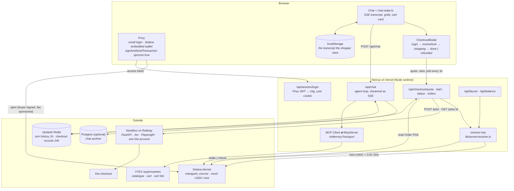
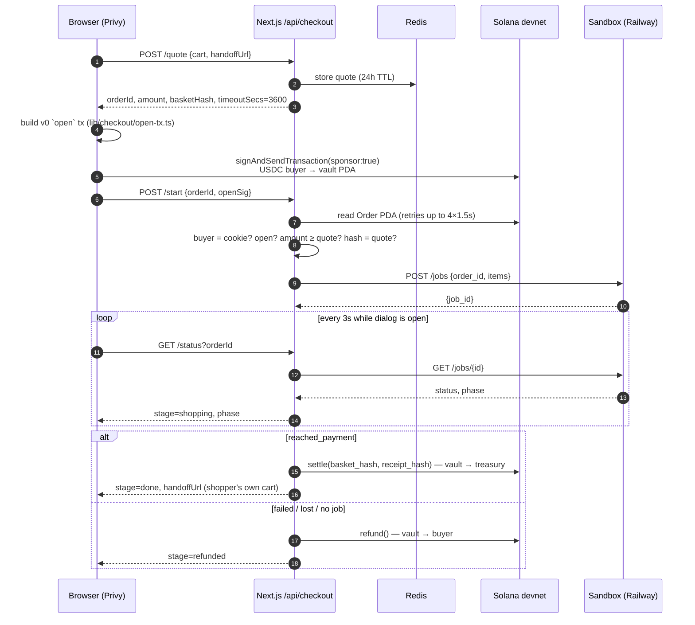
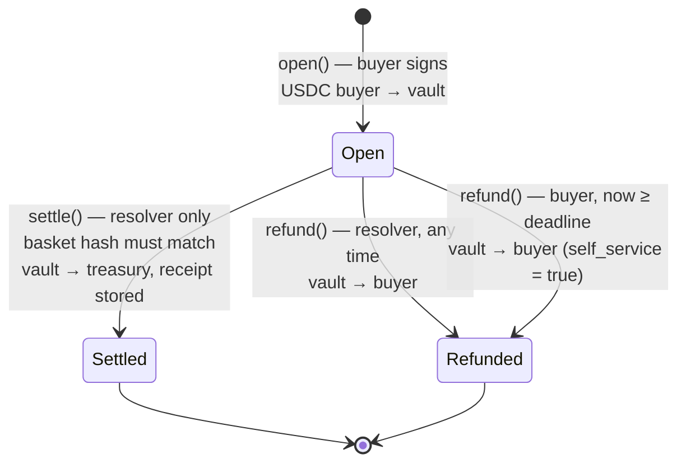

# Architecture

## Overview

changuito is a chat that builds a supermarket basket in Argentina and pays for
it in USDC on Solana devnet. Five pieces, each with one job:

1. **An MCP server** (`packages/mcp`) that speaks to four Argentine VTEX
   supermarkets (Día, Carrefour, Disco, Jumbo): search, price check, cart
   building, and a link that opens that exact cart on the store's own site. It
   predates the hackathon and is vendored in.
2. **An agent** (`apps/web/lib/agent`) that drives it: a streaming Anthropic
   tool loop with the MCP tools on one side and display-only render tools on
   the other. [`../CLAUDE.md`](../CLAUDE.md) documents it in detail.
3. **An escrow program** (`anchor/programs/changuito_escrow`, Anchor 0.32) that
   holds the shopper's USDC between "I approved this basket" and "the basket
   was carried through the store's checkout". See [solana.md](solana.md).
4. **A checkout sandbox** (`services/sandbox`, Python, on Railway): Jev +
   Playwright logging into one Día account, filling the cart and walking
   checkout up to the card form. See [sandbox.md](sandbox.md).
5. **A resolver** — a server-held key inside the Next.js app that settles or
   refunds the escrow on the sandbox's result, and mints devnet USDC for the
   faucet.

What this demo does **not** do, stated up front:

- **No order is placed at Día.** The sandbox stops at the payment step; card
  entry is out of scope and order/payment endpoints are aborted at the network
  level. A settle means "the agent proved it could carry this basket to Día's
  checkout". The shopper finishes the purchase at Día through their own cart
  link.
- **Devnet only, mock USDC.** The mint is ours (`9rYNCi…tdMM`), minted by the
  in-app faucet.
- **The 15% FX buffer goes to the treasury** with the rest on settle. It exists
  because envío is only known at checkout, after the money is locked; returning
  the unused part is not implemented.
- **The sandbox runs one job at a time**, and adds one unit per line (quantity
  is recorded, not applied yet).

## System diagram



---

## The pieces, and why they are shaped that way

### Login is Privy; the session is still ours

Privy does email login and creates a Solana embedded wallet on first login.
The server never trusts the browser's claim of an address: `POST
/api/session/login` takes the Privy access token, verifies it with `jose`
against Privy's JWKS (`lib/privy-server.ts`, `lib/session-issue.ts`), fetches
that user's linked Solana wallet from Privy's REST API (app id + `PRIVY_APP_SECRET`), and mints the existing
HMAC-signed `chg_user` cookie (`lib/login-gate.ts`). Every money route reads
that cookie through `readLoggedInUser`; none of them accept an address in the
body.

### The chain is the record of what was bought

There is no orders table. `GET /api/checkout/orders` runs
`getProgramAccounts` on the escrow with two `memcmp` filters (Order
discriminator at byte 0, buyer at byte 40). The purchases list is therefore the
same on every device, needs no `DATABASE_URL`, and cannot disagree with where
the money actually is.

The checkout record in Redis (`lib/checkout/store.ts`) holds only what the
chain does not: the quote, the sandbox job id, the last phase, the handoff
link. Losing it is survivable — see [failure modes](#failure-modes).

### The amount and the basket are fixed before money moves

`/api/checkout/quote` turns the cart on screen into the arguments of `open`:

- a fresh 32-byte `order_id`;
- `basket_hash` = SHA-256 of a versioned, line-oriented text of the cart
  (`canonicalBasket` in `lib/order.ts`: retailer, cart id, each line's sku,
  quantity, line total and availability, and the total) — not
  `JSON.stringify`, because key order is not a promise;
- `amount` = peso total at today's ARS/USD rate plus 15%, in USDC base units
  (`arsToUsdCents` from `@changuito/mcp/fx`; `ARS_PER_USD` overrides the rate);
- `timeout_secs` = 3600.

`/api/checkout/start` then refuses to start any work until the chain agrees:
the Order PDA exists, its buyer is the cookie's wallet, it is open, it locks at
least the quoted amount, and it commits to the quoted basket hash. The server
believes the chain, not the browser.

### Settle and refund happen on poll, not in the background

There is no worker in the web app. `GET /api/checkout/status` is the only place
that closes an escrow, and it does so as a side effect of being polled:

- job `done` with `reached_payment` → `settle` (vault → treasury);
- job `failed`, job `done` without payment, job lost (404), or no job at all →
  `refund` (vault → buyer);
- sandbox unreachable (any other error) → nothing; keep polling.

The checkout dialog polls every 3 seconds. **If nobody polls, nothing
settles or refunds**: the order stays open until a later poll, or until the
buyer refunds it on chain after the one-hour deadline. That is a deliberate
trade (no queue, no cron, no second process holding the resolver key), and the
on-chain deadline is what makes it safe. It is also a real limitation: the app
has no button for the buyer's self-refund yet, so today it takes a hand-built
transaction.

### The handoff link is the shopper's cart, not the sandbox's

On success the shopper gets `handoffUrl` — the link `get_cart_link` produced
for *their* agent-built cart (`…?orderFormId=…#/cart`). The sandbox's own
`orderFormId` belongs to the operator's Día account; opening it would show
that account's profile and address. It is hashed into the settle receipt as
evidence and never shown as a link.

### The MCP server runs in-process, over a real transport

`lib/mcp/boot.ts` links an MCP `Client` and `McpServer` with
`InMemoryTransport.createLinkedPair()`: real `initialize` / `tools/list` /
`tools/call`, with queues instead of a pipe. Calling the tool functions
directly would be shorter and would defeat the point, which is to show the MCP
server working inside a product.

### Agent, briefly

A streaming tool loop (`loop.ts`, max 12 hops) against `claude-sonnet-5` with
the MCP tools and two render tools that take identifiers only, never prices.
History lives in Redis (1h TTL), the visible transcript in localStorage, and an
optional Postgres archive for signed-in wallets. The prompt tells the model to
say "USDC" and never to mention blockchain, Solana, devnet or escrow to the
shopper. Everything else is in [`../CLAUDE.md`](../CLAUDE.md).

---

## Trust boundaries

| Key | Held by | Can | Cannot |
|---|---|---|---|
| Buyer wallet | the shopper, via Privy's embedded wallet | sign `open` (lock own USDC); `refund` own order **after** its deadline | settle; refund before the deadline; touch another buyer's order |
| Resolver (`AgTnHC…yqQ5`) | the Next.js server (`SOLANA_RESOLVER_SECRET`) | `settle` an open order **to the configured treasury**; `refund` an open order **to the buyer** at any time; mint mock USDC (it is the mint authority) | send escrowed USDC anywhere else; settle against a different basket than was opened; close an order twice |
| Program upgrade authority (`2AF3x8…t15k`, the deployer) | the developer's machine | redeploy the program (standard upgradeable loader) | — this is the one key that could change the rules; it is not frozen on devnet |
| `PRIVY_APP_SECRET` | the Next.js server | look up a verified user's linked wallets (Privy REST, basic auth) | sign anything on chain; the token itself is verified against Privy's public JWKS |
| `SANDBOX_TOKEN` | web server + sandbox | start and read sandbox jobs | move any money |
| Día account credentials | sandbox env only | log in to one Día account | reach Jev (redacted) or the web app |

Why the resolver cannot redirect funds, from the program (`lib.rs`):

- `settle` requires `config.resolver` as signer, `order.status == Open`, a
  matching `basket_hash`, and a destination token account whose `owner ==
  config.treasury` and mint `== config.mint`.
- `refund` requires the destination token account's authority to be
  `order.buyer`.
- `config` is written once by `initialize`; there is no instruction that
  changes the resolver, treasury or mint.

So a compromised resolver can do two harmful things: settle an open order to
the treasury without the basket having happened, or refund early. It cannot
steal to an address of its choosing. The buyer's self-refund after the
deadline does not need the resolver at all.

---

## A checkout, end to end



## Escrow state



Both exits close the vault and return its rent to the buyer. The Order account
is kept as the on-chain record. A second close fails with `OrderClosed`.

---

## Failure modes

| What happens | What the system does | Where the money is |
|---|---|---|
| Sandbox unreachable when `/start` calls it | `startJob` throws; record gets `jobId = 'none'`; the next status poll refunds | back with the buyer after the refund tx |
| Sandbox unreachable during polling (timeout, 5xx) | treated as "not finished yet"; keeps polling, no refund | in the vault; resolved by a later poll, or buyer self-refund after 1h |
| Sandbox restarted (jobs are in memory) | `GET /jobs/{id}` → 404 → read as `failed` → refund | back with the buyer |
| Sandbox job fails (login, item not found, checkout stuck, max steps) | status `failed` → refund, error copied to the record | back with the buyer |
| `SANDBOX_URL` unset in production and `SANDBOX_MOCK` ≠ 1 | sandbox mode is `off`; start records no job; next poll refunds | back with the buyer |
| Order not yet visible to the RPC node at `/start` (or any other `/start` rejection after `open` landed) | 4 retries 1.5s apart, then 409 "Todavía no vemos el pago en la red"; the dialog returns to review with the error. No job is recorded, so `/status` reports `quoted` and never refunds; pressing lock again re-sends `open` for the same `order_id`, which the program rejects because the account exists | in the vault; only the buyer's self-refund after the 1h deadline recovers it (no UI for that yet) |
| Public devnet RPC answers 429 | confirmation polling (`waitFor`) treats a failed status call as a pause, up to 60s; a failed settle/refund leaves the order open and the next poll retries | in the vault until a poll succeeds |
| Two polls arrive together (two tabs, retries) | per-instance `closing` set; chain status read before every close; the program rejects a second close with `OrderClosed`, which the route catches and reports on the next poll | closed exactly once |
| Shopper closes the tab mid-job | the sandbox job keeps running, but **nothing settles or refunds until someone polls `/status` for that order** (reopening the checkout, or the buyer's self-refund after the 1h deadline) | in the vault |
| Checkout record expires (Redis 24h TTL) or Redis is not configured on a multi-instance deploy | `/status` returns 404; the server can no longer close the order | in the vault; only the buyer's self-refund after the deadline recovers it |
| Resolver key missing or mismatched | `resolverSigner` refuses by name; faucet returns 503; settle/refund throw and the order stays open | in the vault |
| Price or envío differs at Día | not reconciled: the 15% buffer is the only cushion, and the whole locked amount goes to the treasury on settle | treasury |

---

## Repository layout

```
changuito/
├── anchor/programs/changuito_escrow/   the escrow program (lib.rs)
├── apps/web/                Next.js — the agent, the UI, the API routes
│   ├── app/api/             chat (SSE), checkout/{quote,start,status,orders},
│   │                          faucet, balance, session/{login,logout}, human
│   ├── components/          Chat, CheckoutModal, WalletProvider (Privy),
│   │                          WalletWidget, Purchases, ReceiveModal, …
│   └── lib/
│       ├── agent/           loop, prompt, render-tools, turn-store, early-ask
│       ├── mcp/             boot (in-memory transport), bridge, session
│       ├── checkout/        sandbox client + mock, escrow-server (resolver
│       │                      side), open-tx (browser side), store (Redis)
│       ├── server/          the resolver key — server-only
│       ├── escrow.ts        hand-written @solana/kit client: PDAs, ixs, decode
│       ├── solana.ts        RPC, send + confirm, Solscan links, units
│       ├── order.ts         canonical basket + receipt text and hashes
│       └── deployments.ts   generated from deployments.json
├── services/sandbox/        Jev + Playwright checkout worker (FastAPI)
├── packages/mcp/            the vendored supermarket MCP server
├── scripts/                 solana-deploy.sh, solana-init.mts,
│                              write-deployments-module.mjs, devnet-e2e.mts
└── deployments.json         program, mint, config, treasury, evidence txs
```
