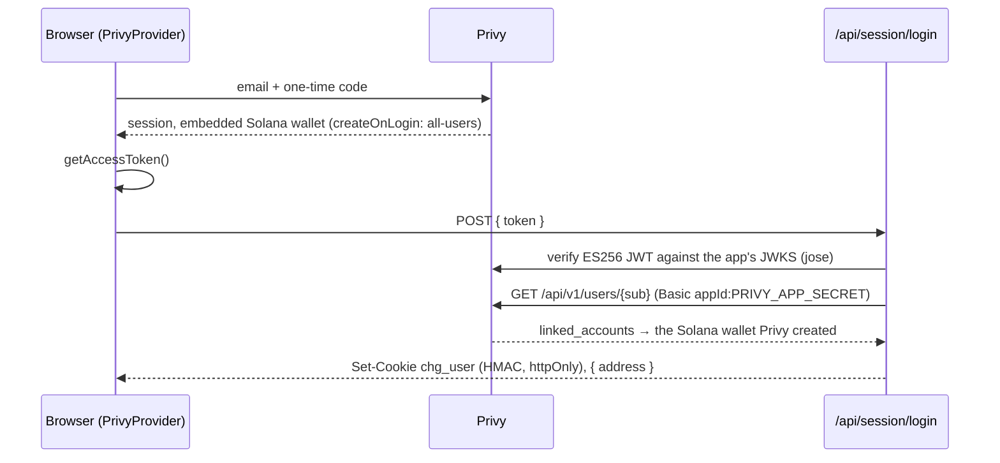
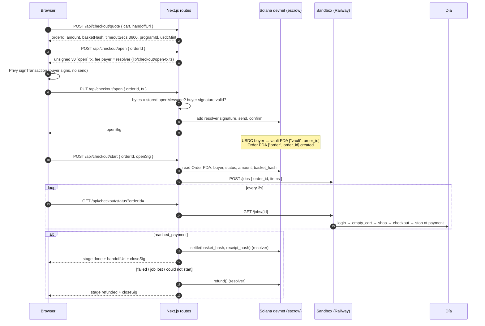
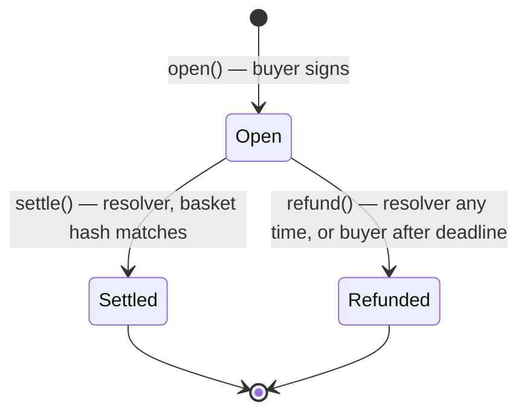

# Basic flows

The paths that matter, in the order a shopper meets them. Everything here runs
on **Solana devnet**: the escrow program, our own devnet USDC mint, and a Privy
embedded wallet per shopper. Every on-chain step links to Solscan
(`https://solscan.io/tx/<sig>?cluster=devnet`).

One sentence to hold onto while reading: **no order is placed at Día.** The
sandbox browser fills a real Día cart and walks checkout to the card form, and
stops there. Reaching that form is what settles the escrow; the shopper
finishes the purchase at Día through their own cart link. Flow 3 says why.

---

## 1. A chat turn

The only streaming path in the app. One user message in, an arbitrary number of
tool calls, and a transcript that has to stay readable while it is being built.

```
BROWSER                       /api/chat                     MCP        ANTHROPIC
   │
   │ POST { sessionId, message, snapshot? }
   ├──────────────────────────►│
   │                           │ withSession(id, snapshot)
   │                           │   warm Map hit, or boot a new
   │                           │   MCP pair and restore(snapshot)
   │                           │
   │                           │ turns.get(sessionId)  ◄── Redis
   │                           │
   │                           │ ┌─ hop 0..11 ────────────────────────────┐
   │                           │ │ messages.stream(model, tools, system)  │
   │                           │ │                          ──────────────►
   │   ◄── text / thinking ────│ │  ◄── deltas ───────────────────────────│
   │                           │ │                                        │
   │                           │ │ for each tool_use:                     │
   │   ◄── tool_start ─────────│ │   MCP tool ──► tools/call ──► VTEX     │
   │   ◄── products / cart ────│ │   render tool ──► emit, no I/O         │
   │   ◄── tool_end ───────────│ │                                        │
   │                           │ │ no tool calls → done                   │
   │                           │ └────────────────────────────────────────┘
   │                           │
   │                           │ turns.set(sessionId, turn)  ──► Redis
   │                           │ chat archive ──► Postgres (signed in only)
   │   ◄── done { snapshot } ──│
   │
   │ keeps the snapshot, sends it back next turn
```

Details worth knowing:

- **Transport is SSE**, with a `:` heartbeat every 15s. A single search against
  a slow storefront can go twenty seconds without a byte, and an idle stream is
  a stream a proxy feels free to close. `X-Accel-Buffering: no` stops a proxy
  buffering the whole thing into one delivery at the end.
- **A `status` event is the first byte of the body**, before the MCP boot and
  before the model, so the UI can tell a slow turn from a dead one. Nothing in
  `lib/turn-progress.ts` is estimated: every stage is something that happened.
- **`MAX_HOPS = 12`.** Past that the model is stuck, not working, and the user
  gets a plain message saying so.
- **The first question is not a model call.** "¿Cuál es tu código postal?" is
  answered in-process by `agent/early-ask.ts` when it is the first message, no
  location is set, and nothing in the text looks like a postal code.
- **Render tools are not traced.** `tool_start`/`tool_end` fire for MCP tools
  only — those reach a supermarket and explain a wait. A render tool moves data
  the user is already looking at.
- **History is written only after a clean return.** A turn that threw mid-hop
  can leave an assistant `tool_use` with no matching `tool_result`, and the API
  rejects that pairing on the *next* request — so the failure would surface one
  message later, on a turn that did nothing wrong.
- **The transcript is a reducer.** `chat-state.ts` folds `UiEvent`s into blocks.
  The hard part is ordering: a grid arrives mid-sentence, and appending it at
  the end of the turn would make the sentence introducing it read as its
  caption.

### What the user sees

```
1. GREETING   what the agent can do, and three starter prompts
2. RESEARCH   "buscando leche…", tool trail, then a product grid
3. RESULTS    the recommended items, and a cart card with a Pagar button
4. CHECKOUT   a three-step dialog: Entrar → Bloquear USDC → Comprar  (flows 2–4)
5. DONE       "¡Compra completada!", an "Abrir en Día" link, and Solscan
              links for the lock and the release — or "No pudimos completar
              la compra" and the refund link
6. RECEIPT    a receipt card at the end of the chat, and the order in
              "Mis compras", read from the chain (flow 6)
```

A guest can chat without signing in: three turns per session
(`FREE_TURNS` in `lib/login-constants.ts`), then the chat asks for a login.
Paying always needs one.

---

## 2. Signing in

Email only. Privy creates an embedded Solana wallet on first login, so a
shopper needs no prior wallet, seed phrase or SOL.



- **The address comes from Privy, not from the browser.** The server reads the
  user's linked Solana wallet itself (`lib/privy-server.ts`), so the cookie
  names a wallet Privy vouches for. Every route after this — chat limits,
  quote, start, status, orders, faucet — reads the address from the cookie
  via `readLoggedInUser` (`lib/login-gate.ts`), never from a request body.
- **Two callers race the same login** (the wallet widget and the chat), so the
  mint is awaitable and de-duplicated per address (`lib/session-login.ts`).
- **`CHG_SESSION_SECRET` signs the cookie.** Unset in production, the login
  route answers 503 and nobody can sign in. Locally it falls back to a dev
  constant, which is also what `scripts/devnet-e2e.mts` uses to mint a cookie
  for a throwaway keypair.
- **`@privy-io/node` is deliberately not used**: it pins `@solana/kit` 5
  against the 8 the app uses. A JWT check and one REST call are the whole
  dependency.

---

## 3. Checkout: quote, lock, shop, settle

The order of these steps is the design. The money moves into a program-owned
vault **before** anyone spends effort shopping, and out of it only on what the
server reads from the chain and the sandbox — never on what the browser says.



### 3a. The quote

`POST /api/checkout/quote` turns the cart on screen into the arguments of
`open`:

```
orderId    = crypto.getRandomValues(32)          random, NOT derived
basketHash = sha256(canonicalBasket(cart))       lib/order.ts
amount     = arsToUsdCents(total, arsPerUsd, 0.15)  @changuito/mcp/fx
             (ARS_PER_USD pins the rate; otherwise the live feed)
timeout    = 3600s
```

- **The 15% is for envío**, which the store only reveals at checkout — after
  the money is locked. It is float, not price, and on settle it goes to the
  treasury with the rest. That is a demo simplification and is stated as one.
- **`basket_hash` commits to the exact basket** — retailer, cart id, each
  line's index, SKU, quantity, line total and availability, and the total —
  as a versioned line-oriented text, not `JSON.stringify`, because a hash is a
  promise about bytes and key order is an accident of whoever built the
  object. The USDC amount is deliberately not in it: the program stores that
  as its own field.
- **`order_id` is random.** `open` rejects an id it has seen, which stops a
  double submit; a deliberate retry of the same basket must be a new order.
- The quote is stored server-side (`lib/checkout/store.ts`: Upstash Redis,
  24h TTL, an in-process Map without credentials) together with the
  shopper's own cart link, `handoffUrl`.

### 3b. The lock

`POST /api/checkout/open` builds the `open` transaction with the **resolver**
as fee payer, stores its message bytes on the checkout record (`openMessage`)
and returns it unsigned. The browser has Privy sign it as the buyer — sign
only, no send — and hands it back with `PUT`. The server refuses it unless
the message bytes are exactly the stored ones and the buyer's ed25519
signature verifies, because a key that pays fees must never co-sign arbitrary
bytes from a browser. Then it adds the resolver's signature, sends, waits for
confirmation and returns `openSig`.

**The resolver pays the fee. It does not pay rent**: `open` creates the Order account and the vault token account,
about 0.004 SOL between them, and the buyer pays that — which is why the
faucet sends 0.01 SOL with the USDC (flow 5). The vault's rent comes back to
the buyer when it closes; the Order account stays on chain as the record.

If the balance is short of the quote, the dialog shows **Cargar 50 USDC de
prueba** next to the lock button, and the lock button stays disabled until
the balance covers it.

### 3c. Start: believe the chain, not the browser

`POST /api/checkout/start` reads the Order PDA (retrying, since a fresh
transaction can lag one RPC node behind another) and refuses unless:

| Check | Refusal |
|---|---|
| the account exists | 409 *Todavía no vemos el pago en la red.* |
| `buyer` = the cookie's wallet | 403 |
| `status` = open | 409 |
| `amount` ≥ the quoted amount | 409 |
| `basket_hash` = the quoted hash | 409 *El changuito bloqueado no es el cotizado.* |

Only then does it start a sandbox job. It is idempotent: a second call for an
order that already has a job returns its status. If the sandbox cannot be
started at all, the record is marked `jobId: 'none'` and the next status poll
refunds.

### 3d. The sandbox shops

`services/sandbox` ([sandbox.md](sandbox.md)) is a Python worker: Jev
(TypeSafe's System One model, which answers typed questions and never
generates text) picks among the visible controls, and Playwright executes the
choice on Día's real site, in four phases. The dialog shows each one:

| Phase | Shown as |
|---|---|
| `queued` | En la fila para comprar… |
| `login` | Entrando a Día… |
| `empty_cart` | Vaciando el carrito de Día… |
| `shop` | Cargando los productos en Día… |
| `checkout` | Pasando por la caja… |
| `payment` | Llegando al pago… |

It **stops at the card form**. It is never offered a "comprar / confirmar /
pagar" control, and the order and payment endpoints (`/transaction`,
`/payments`, `gatewayCallback`, `orderPlaced`) are aborted at the network
level. One job at a time, because there is one operator Día account and its
cart is bound to its session.

Without `SANDBOX_URL` (local development) an in-process mock walks the same
phases on a clock — login 0s, empty_cart 4s, shop 7s, checkout 15s, payment
20s — and reports `reached_payment`. `SANDBOX_MOCK_FAIL=1` makes it fail at
checkout, which is the refund path. In production without `SANDBOX_URL` the
checkout is off unless `SANDBOX_MOCK=1`.

### 3e. Settle, and the handoff

When a poll finds `reached_payment`, the status route settles:

```
receipt = canonicalReceipt(order, buyer, basket, amount, settledAt)
          with basis|sandbox-reached-payment
          + job|<sandbox job id>
          + orderform|<the sandbox's own Día orderFormId>
settle(basket_hash, sha256(receipt))      resolver-signed
   vault → treasury, vault closed (rent → buyer), status Settled,
   receipt_hash stored on the Order account
```

The shopper sees **¡Compra completada!**, an **Abrir en Día** button, and
Solscan links for the lock (*Bloqueo*) and the release (*Liberación*).

**Abrir en Día opens the shopper's own cart**, the `handoffUrl` the agent got
from `get_cart_link` (`…/checkout/?orderFormId=…#/cart`) — **not** the
sandbox's cart. The sandbox's cart belongs to the operator's Día account;
opening it would show the shopper somebody else's profile and address. Its
`orderFormId` goes into the receipt hash as evidence, and nowhere on screen.

What "settled" means, precisely: *the agent proved this basket could be
carried to Día's payment step.* It is not *Día confirmed an order*. The
shopper still pays Día at the store, from the handoff link.

### 3f. Close is idempotent

A poll that arrives twice cannot close twice. The status route reads the
Order account first and only writes if it is still open; an in-process set
guards one close per order per instance; and the program itself rejects a
second close with `OrderClosed`. A sandbox that answers 5xx or cannot be
reached is not yet a failure — the route keeps polling.

---

## 4. The refund path



Refund happens when the job reports `failed` (or `done` without reaching
payment), when the sandbox answers 404 for the job (it keeps jobs in memory,
so a restart loses them), or when the job could not be started. The resolver
signs `refund()`: vault → buyer's USDC account, vault closed, status
Refunded. The dialog says **No pudimos completar la compra** / *El escrow
devolvió tus USDC a tu billetera* and links the refund on Solscan
(*Devolución*).

Both terminal states are final: an order closes once, and a refunded order
cannot then be settled. The program also lets **the buyer** refund their own
order once the deadline (1 hour after `open`) has passed — the escape hatch if
the backend never comes back. That instruction exists and is tested on
devnet; there is no button for it in the app yet.

Evidence, from `scripts/devnet-e2e.mts` with `SANDBOX_MOCK_FAIL=1`:
[open](https://solscan.io/tx/2vaNKpBuuYbnfgT3gaZwr2gwcKbYLjgrP2dfAZBzr2PgheuXuHEDedVSkoHdhL6ZDsW88mofSZPjkyFKYvDXHbCZ?cluster=devnet) →
[refund](https://solscan.io/tx/244i1SqumYySTLBSFkEnPRN6KFEqBDWNEC9GQfPU9zEdsouRYVuwdPgtAGYMVY2BULq8KoEsPruPCqrDMyYVExKP?cluster=devnet).
The settle path from the same script:
[faucet](https://solscan.io/tx/36qKsuaGykkY9NyrkGG4PKNArByv6fXJtf5bBNNj2sUoQ1cV7DGebdqZJnLXmkdEncZjkRoncaCFDeo6zWUzgqzL?cluster=devnet) →
[open](https://solscan.io/tx/5aShGUf3h1cJvNuLDUNZXjpBCBEf18bHkq8GpkcnN1D4yJaumBfNJkqNacRqMkBYq7r4FvEtnrTK1ZyRAyLze35Z?cluster=devnet) →
[settle](https://solscan.io/tx/32qUpErth2AG72KvXPCNSDX5NY9ftwsaH7u6SYSpZaB3N6b6Kz8csjhAWpNckTdsEkH53HPBQk2eySDrsjGR9a4K?cluster=devnet)
(5.06 USDC for a $6.150 ARS basket at 1400 ARS/USD + 15%).

**One gap, stated.** Settle and refund are triggered by the status poll, and
the only poller is the open checkout dialog. A shopper who closes the dialog
mid-purchase leaves the order Open: the sandbox job keeps running, but nothing
closes the escrow until the dialog polls again, or the buyer refunds after the
deadline. A server-side sweeper is the fix and is not built.

---

## 5. Funding a wallet: the devnet faucet

Our USDC is our own devnet mint
([`9rYNCiaa…tAtdMM`](https://solscan.io/account/9rYNCiaaKQ5rT1QR8Ar6FJVUr7gnwZy3RYAT6MtAtdMM?cluster=devnet),
6 decimals), and the resolver is its mint authority, so the faucet is one
resolver-signed transaction:

```
[Cargar 50 USDC de prueba]  ──►  POST /api/faucet      (no body)
                                    │
                                    │ 0. human gate (Turnstile), then the
                                    │    chg_user cookie — the address is
                                    │    the cookie's, never the body's
                                    │ 1. faucetVerdict(balance, lastGrant)
                                    │      ≥ 100 USDC held → 429, "ya tenés"
                                    │      < 60s since last → 429, "esperá"
                                    │
                                    │ ONE transaction, resolver-signed:
                                    │   create the USDC ATA (idempotent)
                                    │   mintTo 50 USDC
                                    │   + 0.01 SOL, if the wallet holds
                                    │     < 0.006 SOL
                                    ▼
                                 { usdc, usdcDisplay, txHash, created }
```

- **The SOL is rent, not fees.** The resolver pays the `open` fee; it does
  not pay for the accounts `open` creates. Without the SOL a fresh wallet holds USDC and
  cannot open an order with it. One transaction means a shopper never ends up
  with one and not the other.
- The policy is pure and tested (`lib/faucet-policy.ts`): grant 50, stop at
  100 held, 60s cooldown. The cooldown is per instance and in memory on
  purpose — it stops a stuck button making one hot key sign fifty
  transactions, not a determined adversary.
- The faucet appears in two places: the wallet widget, and inside the checkout
  dialog when the balance is short of the quote.

---

## 6. What I bought: the purchases list

`GET /api/checkout/orders` reads the escrow program, not a database:

```
getProgramAccounts(program, filters: [
  memcmp(offset 0,  Order discriminator),
  memcmp(offset 40, buyer = the cookie's wallet),
])
→ decodeOrder → newest first, at most 50
→ { orderId, amountDisplay, status: open|settled|refunded, openedAt,
    explorer: Solscan link to the Order account }
```

The chain is the record, so the list is the same on every device, survives a
cleared browser, and needs no `DATABASE_URL`. Shown as *En curso*,
*Completada* or *Devuelta* in "Mis compras" (`components/Purchases.tsx`).

Separately, the chat that paid gets a receipt card (localStorage,
`chat-store.ts`) with the lines and total as they were on screen, and the chat
becomes read-only: one chat is one order.

---

## 7. Receiving: the QR

Clicking the short address in the wallet widget opens
`components/ReceiveModal.tsx`: the
shopper's whole Solana address as a QR (the bare address, nothing else) and a
copy field. It is how someone sends devnet USDC or SOL to a Privy wallet from
another wallet. Nothing server-side is involved.

---

## 8. The escrow program, in one screen

`anchor/programs/changuito_escrow/src/lib.rs`, Anchor 0.32, deployed at
[`9A2PXJaf…eXB2wC9`](https://solscan.io/account/9A2PXJafYxym4i8ah1QFQZngqz2j7rQh8xQX2eXB2wC9?cluster=devnet).
The full account layout and the client are in [solana.md](solana.md).

```
initialize(resolver, treasury)        once; Config PDA ["config"] holds
                                      resolver, treasury, mint. No admin
                                      or upgrade path in-program
open(order_id, amount, basket_hash, timeout_secs)       buyer signs
    amount > 0                        else InvalidAmount
    300s ≤ timeout ≤ 30d              else InvalidTimeout
    order_id unseen                   else (init fails: account exists)
    Order PDA ["order", order_id]; vault PDA ["vault", order_id],
    owned by the Order PDA; USDC buyer → vault; emit Opened
settle(basket_hash, receipt_hash)     resolver only
    status Open                       else OrderClosed
    basket_hash matches               else BasketMismatch
    vault → treasury, close vault (rent → buyer), status Settled,
    store receipt_hash; emit Settled
refund()                              resolver any time, or buyer after
                                      deadline; anyone else NotAuthorized
    vault → buyer, close vault, status Refunded; emit Refunded{self_service}
```

The status is written **before** the transfer in both closes.
